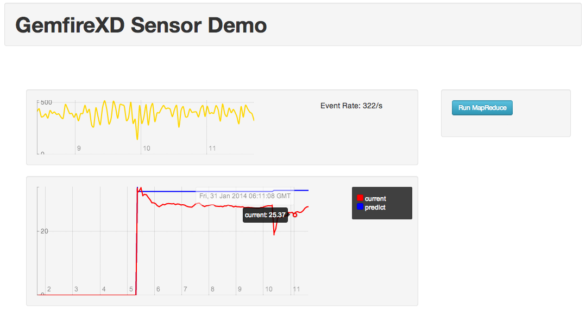

GemfireXD Demo
==============

Background
----------

This demo is based on the [DEBS 2014 Challenge]. It uses the data set presented there and strives to achieve the objectives of the challenge.

The demo is intended to illustrate how time-series data may be ingested into GemFireXD, evicted to Hadoop/HDFS, prcessed there and then have the results be fed back into GemFireXD.

Structure
---------

The repo consists of 4 sub-projects:

* `gfxd-demo-loader` - The loader which used to stream events into the system.
* `gfxd-demo-mapreduce` - The MapReduce component which produces load prediction data.
* `gfxd-demo-web` - The web UI component.
* `gfxd-demo-aeq-listener` - An optional AsyncEventQueue component which serves the same purpose as the MapReduce part. Use this if you don't have Hadoop.

Schema
------

Only two tables are used by the demo. One is used to hold incoming sensor data (`raw_sensor`) and the other is used to hold load average data used for load prediction (`load_averages`). Both tables are partitioned by `house_id`.

    -- raw_sensor table

    id           bigint
    timestamp    bigint
    value        float(23)
    property     smallint
    plug_id      integer
    household_id integer
    house_id     integer
    weekday      smallint
    time_slice   smallint

    -- load_averages table

    house_id     integer
    household_id integer
    plug_id      integer
    weekday      smallint
    time_slice   smallint
    total_load   float(23)
    event_count  integer

Although sensor data is recorded per second, the smallest aggregation is 5 minutes, thus each row in `load_averages` represents the average load for a given 5-minute slice, per weekday, per unique plug. Slices are numbered 0-287.

Data
----

Unfortunately the original data provided for this challenge is very large and unwieldy. Included with the source for this demo is pre-computed load_averages data for only 10 houses (approximately 500 plugs) and a much smaller (2 million entries) subset of the original sensor data set. A larger set of data (100 million rows) can be found here...

The provided data is compressed. Make sure to uncompress all files in the `data/` directory.

Building
--------

The demo is built using Gradle which is bundled.

You will need a release of GemFireXD - specifically the sqlfire.jar and sqlfireclient.jar files.

Create or edit `gradle.properties` in the source root directory defining the GFXD_HOME property which should point to your GemFireXD product directory. For example

    # gradle.properties file
    GFXD_HOME = /opt/gemfirexd-0.5-beta

Then simply build with:

    ./gradlew build

Running
-------

Running the demo involves 3 main phases, namely _setup_, _ingest_ and _mapreduce_.

### Setup

The setup phase consists of starting up a GemFireXD cluster and populating the load_averages table. This step is achieved with:

    ./gradlew cycle

This task performs the following actions:
* Stop the current GemFireXD server
* Clean up the server's directory - `server1/`
* Start a GemFireXD server
* Create the necessary tables
* Import data into the `load_averages` table

### Ingest

This step starts up the web application which serves the UI as well as perfoming the ingestion. Run with:

    ./gradlew gfxd-demo-web:jettyRun -DloadFile=$PWD/data/sorted2M.csv -DconfigFile=$PWD/gfxd-demo-loader/config.properties

Initially, 5 minutes worth of sensor data will be consumed as quickly as possible and then the data will be ingested by the second. This is done to seed the operational data so that the prediction model will have data to work with. The UI can be checked at `http://localhost:8080/ui/index.html`.

### Mapreduce 

Once ingestion has been running for a while, the operational data will start to be evicted to HDFS. In order to run the provided MapReduce job, ensure that you have your CLASSPATH set correctly:

    export CLASSPATH=$CLASSPATH:gfxd-demo-mapreduce/build/libs/gfxd-demo-mapreduce-1.0.jar

Ensure that you have HADOOP_HOME and other hadoop environment variables set.

Call the MapReduce job:

    yarn jar gfxd-demo-mapreduce-1.0.jar -Dmapreduce.framework.name=local \
        -Dmapreduce.cluster.local.dir=/tmp/mr-local \
        -Dsqlfire.url="jdbc:sqlfire://localhost:1527"

The job will generate entries on `load_averages` table, which will be used for prediction analysis.

### AsyncEventQueue Listener

If you do not have a Hadoop environment available, you may simulate the MapReduce functionality by commenting out the relevant section in the `data/schema.sql` script to activate the `AggregationListener`.

[DEBS 2014 Challenge]:http://www.cse.iitb.ac.in/debs2014/?page_id=42

